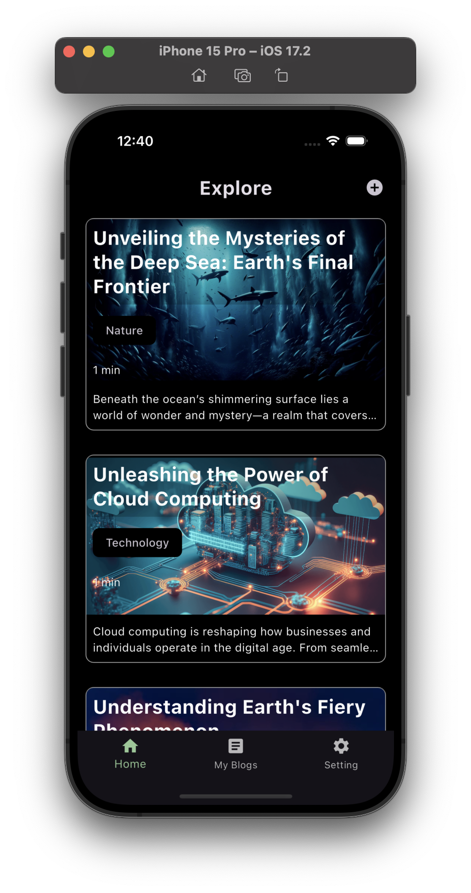
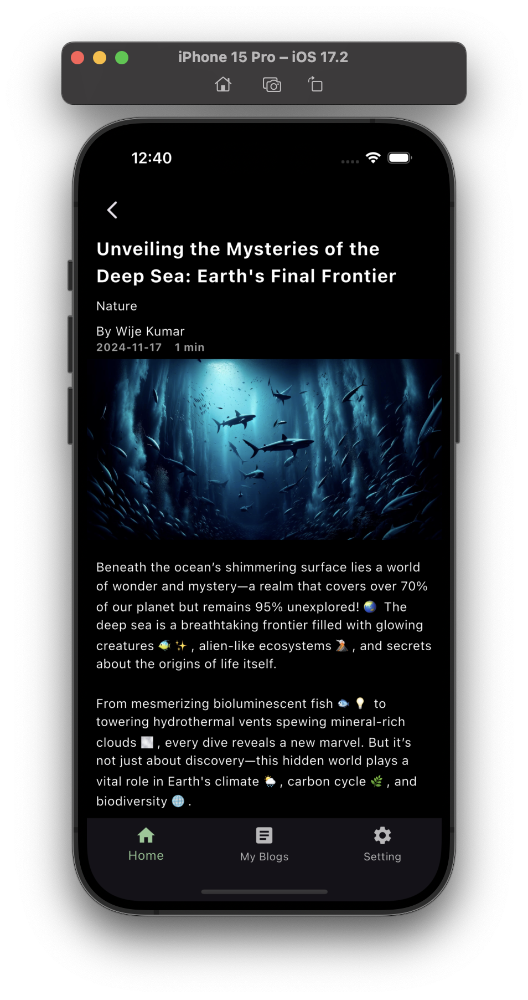

# Blog App 📱

A mobile application built with **Flutter**, designed to practice **Clean Architecture** and implement **SOLID principles**. This app provides a feature-rich blogging experience with support for both online and offline modes.

## Screenshots 📸

<div style="display: flex; justify-content: space-around;">




</div>


## Features 🚀

- **Authentication**: Sign-in and sign-up functionality using Supabase.
- **Blog Management**: Add, edit, delete, and read blogs with ease.
- **Theme Switching**: Toggle between light and dark modes.
- **Offline Support**:
  - Fetches data from the remote database in online mode.
  - Utilizes locally stored data when offline for seamless user experience.

---

## Technologies Used 🛠️

- **Frontend Framework**: Flutter
- **State Management**: Bloc and Cubit
- **Authentication and Remote Database**: Supabase
- **Local Storage**: Hive
- **Dependency Injection**: GetIt

---

## Installation & Setup ⚙️

Follow these steps to get the app running on your local machine:

1. Clone the repository:
   ```bash
   git clone https://github.com/rashmirekha99/blog_app.git
   cd blog_app
   flutter pub get
   flutter run
---
## Contributing 🤝

Contributions are welcome! If you'd like to contribute to this project, please follow these steps:

1. **Fork** the repository.
2. **Create a new branch**:
   ```bash
   git checkout -b feature-name
   git commit -m "Add some feature"
   git push origin feature-name
---
## Feedback 💬

We’d love to hear your thoughts! If you have any feedback or suggestions, feel free to:

- Open an issue on the repository.
- Share your ideas or improvements via email.

Your input is invaluable in making this project better. Thank you for your support! 🙌


